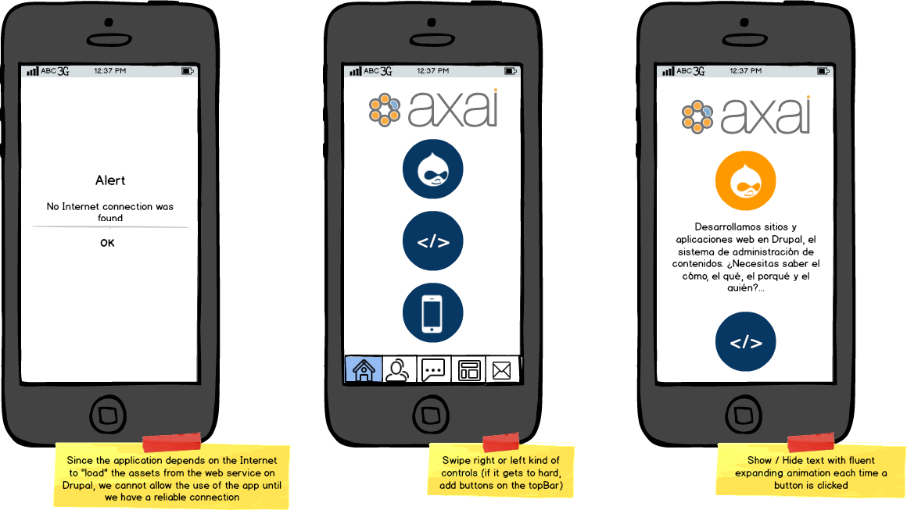
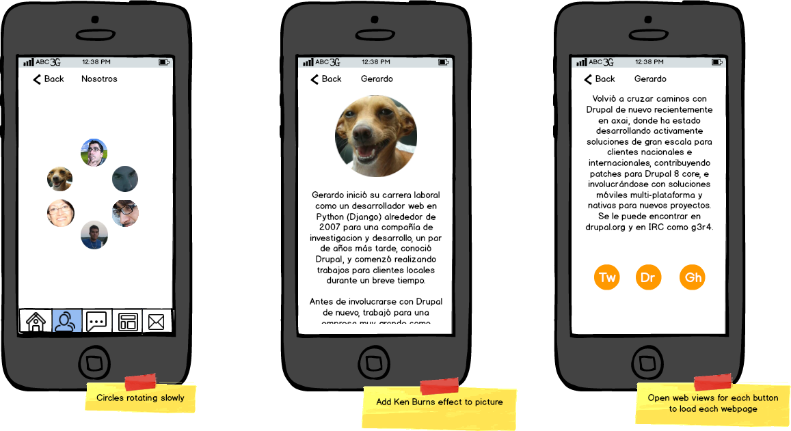
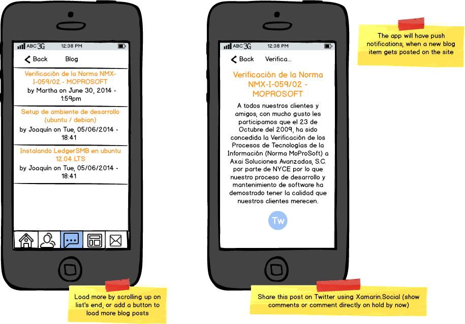
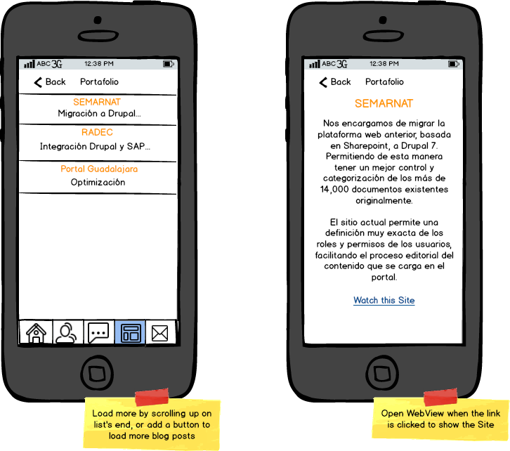
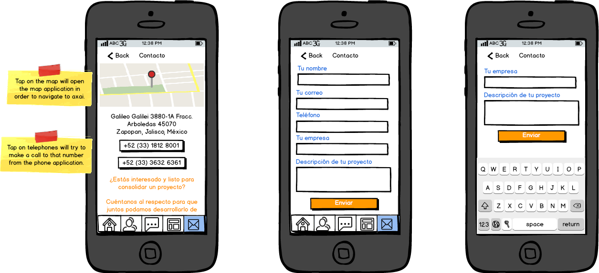
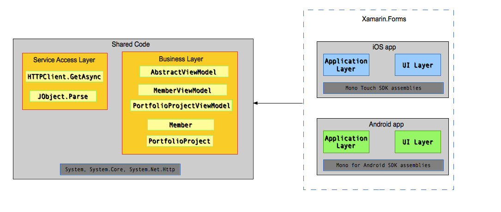

### Defining requirements

We want to perform a very simple Drupal integration with this app so, the things that we want the app to perform, and the things we need to to on the Drupal site are the following:

#### Drupal side:

1\. Enable the output of information like users and portfolio item pages as JSON.

2\. Send push notifications to each platform when a new blog post gets published. (planned for version 2.0)

#### Application side:

1\. Detect whether or not the application has access to the internet.

2\. Get the contents of each section via async http client request.

3\. Create a tabbed view which will hold the 4 main display pages of the axai site  (About us, Blog, Portfolio and Contact form).

4\. Show the blog posts using a WebView.

5\. The contact form should perform a POST to the Drupal site, in order to process this information.

### User Interface Mockups

  

Axai home

  

About us

  

Blog

  

Portfolio

  

Contact

### Designing the App architecture

Since this is going to be a multiplatform application, a block diagram demonstrating the different layers of the application architecture is shown below:

After working a little bit with [Xamarin.Forms](http://developer.xamarin.com/guides/cross-platform/xamarin-forms/), we felt like this was the right option for this project because we would want to have a very similar native experience on both platforms, while mantaining almost the same code for both applications.

Drupal and Xamarin, building the Axai mobile application: Part 3