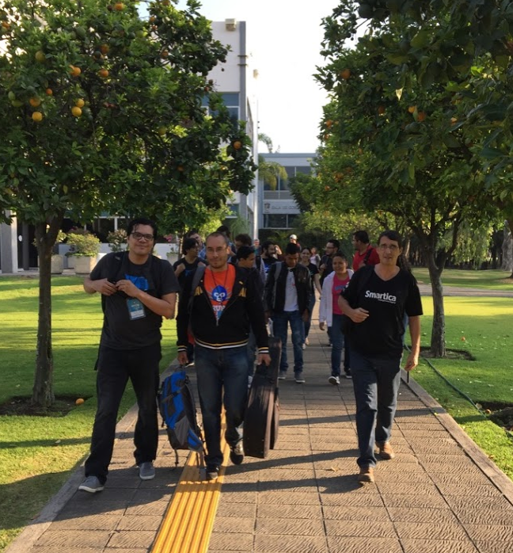
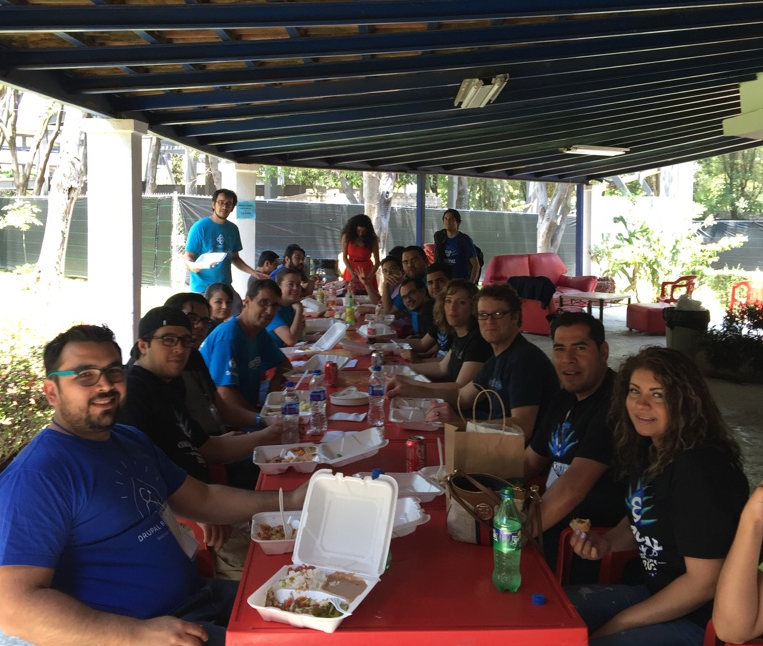

Translated by [gerardo](http://www.axai.com.mx/en/team/gerardo)

Waiting for April… - Like a popular trovador's song (Silvio Rodriguez), in the midst of the month in which we celebrate children, and with the heat of the spring sun all over us, the "pearl of the West" (Guadalajara) was patiently waiting to be the host of the event which gathers excellent domestic and foreign software developers, real Internet rockstars, a few geeks and some IT lovers: [**Drupal Camp Guadalajara 2016**](http://www.drupalcampgdl.com), with the slogan: "The freedom to create the web of the future", became a romatic relationship between Asimov book titles and the Drupal community.

This time, it was the turn for Tapatios (Jalisco’s demonym) to organize this high caliber meeting, but it is worth mentioning that many hands and minds from all over Mexico and beyond were involved, and without their support, this double purpose event would not have been possible. We had one day devoted to workshops (Global Training Day and beyond) and two days for Drupal talks.

Contributions from Karim, our Belgian-Bolivian friend, who was working hard from his trench with all his expertise in marketing. Our paisanos (people from our country living abroad) Arlina and Israel, who from San Francisco, were sending commits to the Drupal Camp web site, altogether with their essential enthusiasm. Omar and Olivas, unconditional Drupal talents and Drupal Mexican Rockstars. Felipe Neville and his team, who worked on our logo redesign with the characteristic Jalisco’s agave. Irene Huizar and Oscar Perez, whom with all their organizing experience in big conferences, opened up CUCEA’s (our venue) doors once again, to have a beautiful space for the talks and all the activities, Drupal Association, whose [Community Cultivation Grants](http://assoc.drupal.org/grants) program helped start paying bills on time, and the great support provided by all the staff members and volunteers, who helped a lot and always had a smile on their faces. 

Someone can only imagine what it takes to create a Drupal camp, but we can assure you, that the reality exceeds the expectations… the ample Hangouts meetings, the inevitable crusade in our quest to get sponsors, logistics, lost e-mails, last minute cancelations, [media promotion](https://www.youtube.com/watch?v=yQVqXmoNud8), college visits, t-shirts, keynotes…

This year we had the blessing of a well known Drupal training company, [drupalize.me](http://drupalize.me), who sent their Lead Trainer: Joe Shindelar. We have already met him in several videos sharing the way to implement a custom module the “Drupal way” among many other tutorial videos, but in the camp, his translated interpreted English keynote (Remarkably interpreted by Elias de la Torre), was about a very relevant topic for the Open Source spirit and community: “El arte de compartir” (The art of sharing), why is important to do it, and all the good things that come along in the road when you do it, and believe us when we tell you that, when his keynote was over, you could feel in the air, the essence of **GNU GPL** which was inviting several of the participants to share something right at that moment… Even if it was a story, a sandwich bite or a patch to Drupal or the **Drupal Console**… the CLI of the moment, the one which in it’s own way champions the Latin American Drupal community, it is not clear, if it is because their main contributors are from this region… Many controversies have risen from it, but the project continues strong, and instead of having the scaffolds collapsing, it has been positioning itself as a very pragmatic tool to learn and debug Drupal 8, of course, we have in Mexico three of it’s stars, and their talks were an example of the great level we have here.

Contributions also thank to our friends from Costa Rica Jeff and Allan, who from their paradisiac country, arrived to talk about an interesting project and their expertise with it: [Dkan](http://www.nucivic.com/dkan/), which has been adopted by Costa Rica’s government for the delivery of open data, it was a pleasure to know that the civil conscience and politics initiatives are not alien to the Open Source projects and communities.

We also had Carla Briseno’s wonderful presence, co-founder and vice-president of Bixal, a digital services and Drupal development company. She was a keynote speaker too, who talked about her experience with [Drupal in ONGs and government](http://www.slideshare.net/CarlaBriceno/drupal-y-gobierno-digital). (We had a very activist camp!). Carla is a display of enthusiasm and human quality, it was a great thing to know that her excellent Spanish, is due to her altruistic labor with the Latin American community… and also for having a Venezuelan husband!

Not everything was Drupal 8 in this camp, we also had two very talented developers, Backdrop creators: Jen & Nate, who we already had the pleasure to meet two years ago at Mexico City Drupal camp, in that occasion they went to the Teotihuacan pyramids. Well, this time, they wanted to have some tequila and tortas ahogadas, so, after they showed us all the new features of their forked CMS, we went to the nearby colonial magic town of Tlaquepaque, to enjoy the mariachis, the tequila of course, and the great food. [Here you can read their experience in their own words.](https://backdropcms.org/news/backdrop-cms-guadalajara)

Now **Drupal Camp Guadalajara 2016** is written in the history archives, as a testimony of a growing latent community, a high-level event… the closure, the acknowledgements to our sponsors, Drupal Association, Chapter Three, Indava, Acquia, y Universidad de Guadalajara por hosting us at CUCEA venue. And finally, we closed the event with the [Drupal Latin Son](https://www.youtube.com/watch?v=bCDd1yH01GM)… So many great moments, it was amazing to be with all of our friends and build new affective and work relationships with all the people there… A camp with a great taste of pluralism, diversity, strength, distinctive qualities of our group and community. Familiar faces... new friends, acceptance looks, empathy. It was proposed that our next event would be held at the beaches of Puerto Vallarta, why not?, We, the developers, know how to have fun, enjoy life, build bridges and above all else, build our dreams with code.