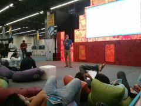
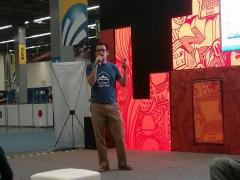
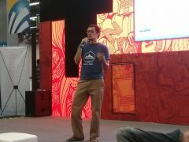
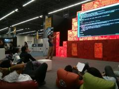
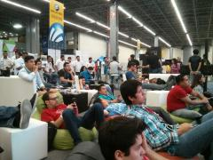
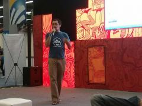

El día de hoy Axai estuvo presente en #CPMX6, dando una charla sobre aplicaciones web con mapas, georeferenciación y su integración con CMS como Drupal.

[Las diapositivas están disponibles en google drive.](https://t.co/neOOVeOIBv)

Aquí algunas fotos:

La presentación se puede ver [aquí](https://docs.google.com/presentation/d/1-GT6PO-5rOlU0qQp6FTZuiVg3oSKaq70MrGqOjDlzZ8/).