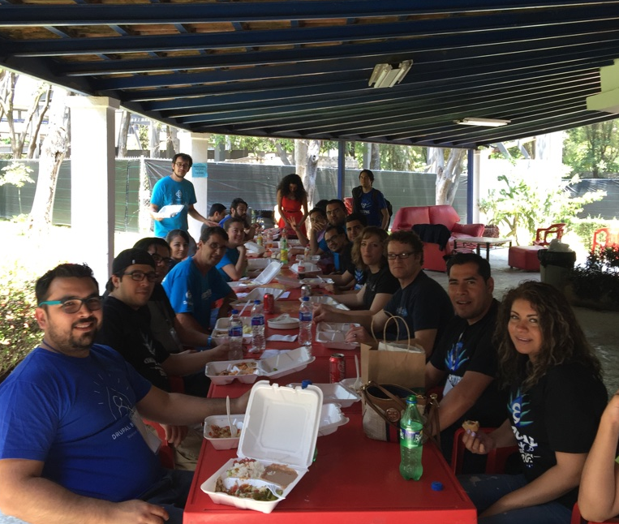
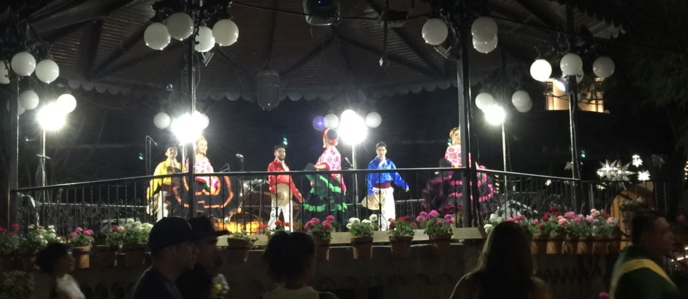

Como esperando abril… - Como la canción de Silvio, así de esa manera, en los albores del mes en que se festeja a los niños y ya con el calor del sol de primavera en el cenit, la "_perla de occidente"_ estuvo esperando con paciencia el ser anfitriona del evento que reúne a excelentes desarrolladores de software nacionales e internacionales, a verdaderos protagonistas del Internet, a algunos geeks  y a varios amantes de las Tecnologías de la Información: El **Drupal Camp México** **en su emisión 2016**, el cual con el  epígrafe de “_La libertad de crear la web del futuro_”,  realmente enmarcó un idilio entre los títulos de los libros de Asimov y la comunidad de Drupal en nuestro país.

 Ahora tocó a los tapatíos organizar de nueva cuenta esta reunión de gran calibre, pero cabe mencionar que varias mentes y manos de otros lugares estuvieron presentes y las cuales sin su apoyo, este evento no hubiera podido ser consolidado. Aportaciones  como las del buen Karim, el boliviano-belga quien estuvo atento desde su trinchera con su experiencia en tópicos de mercadotecnia. Mis paisanos Arlina e Israel, quienes desde San Francisco enviaban sus commits al sitio del Camp junto con su entusiasmo imprescindible. Omar y Olivas, incondicionales talentos en Drupal y rockstars región 4. Felipe Neville y su equipo, los cuales realizaron el rediseño del logo con el característico agave de Jalisco. También Irene Huízar y Oscar Pérez, quienes con su experiencia al ser organizadores del FLISOL, nos abrieron una vez más las puertas del CUCEA para repetir la fórmula y tener un espacio de alto rendimiento para charlas y comensales. Indiscutible el gran apoyo de los voluntarios  y miembros del staff del centro universitario, cuyos nombres no menciono por falta de memoria.

Uno se puede imaginar lo que involucra el hecho de implementar un evento de tecnologías, pero les puedo asegurar que la realidad supera las expectativas… Las pletóricas juntas a través de “Hangouts”, la cruzada inevitable por la búsqueda de “sponsors”, la logística, los correos perdidos, las cancelaciones de último momento, [la promoción en medios](https://www.youtube.com/watch?v=yQVqXmoNud8), las visitas a las universidades, las  playeras conmemorativas, las conferencias magistrales…

Este año tuvimos la venia de una conocida compañía de capacitación en Drupal, [drupalize.me](https://drupalize.me/), de la que pudimos contar con Joe Shindelar, Lead Trainer de la misma. Lo había visto en varios videos compartiendo la manera de implementar un custom module muy a la “Drupal way” entre otros tutoriales de la serie, pero en el Camp su Keynote en inglés, - traducido, interpretado con el profesionalismo del Ing. Elías De la Torre- trató de un tema relevante dentro de lo que concierne al espíritu del Open Source: “El arte de compartir”, el porqué hacerlo y las satisfacciones que otorga y créanme  cuando les digo que al terminar su charla de la sala emanaba un aire de **GNU** **GPL** que incitaba a varios de nosotros a compartir en ese preciso momento… Aunque sea unos buenos chistes, un pedazo de sandwich o un parche a la **Drupal Console**… La Drupal Console… El **CLI** del momento, aquél que de alguna manera abandera a la comunidad Latinoamericana, no estoy seguro si sea porque sus principales contribuidores son de esa región… Cuántas  controversias ha generado, pero el proyecto sigue estoico y lejos de que les explote el “boiler”-plate se ha ido posicionado como práctica herramienta para aprender y depurar la última versión de Drupal, desde luego que contamos con tres de sus protagonistas y sus charlas dieron testimonio del buen nivel que se maneja en México referente a temas contemporáneos en la comunidad: Composer y Desarrollo de módulos en Drupal 8, entre otras aportaciones…  Aportaciones… Aportaciones las de nuestros amigos “ticos” Jeff y Allan, que desde su paradisíaco país, arribaron para presentar un interesante proyecto: [Dkan](//www.nucivic.com/dkan/), que actualmente ha sido adoptado por el gobierno de Costa Rica para la presentación de Datos Abiertos, (entiéndase leyes de transparencia para ver de que lado masca la iguana), en fin, fue un gusto saber que la conciencia cívica y las iniciativas en torno a política no son ajenas de los proyectos de Software Libre.

Por otra parte también contamos con la grata presencia  de Carla Briceno, fundadora y vicepresidente de Bixal, una compañía que ofrece servicios digitales y desarrollo en Drupal. Ella fue nuestro segundo conferencista magistral quien habló desde el tamiz de su experiencia sobre la aplicación de [Drupal en ONG’s e Instituciones de gobierno](http://www.slideshare.net/CarlaBriceno/drupal-y-gobierno-digital). (Podemos constatar que este fue un Camp muy activista). Carla es un despliegue de entusiasmo y calidad humana, me gustó en lo personal tener varios momentos de charla con ella y saber que el excelente nivel de castellano que maneja es debido en gran parte, a su trabajo altruista en la comunidad Latinoamericana y  también por tener un esposo venezolano…

Y como es costumbre y para no dejar de lado el tema de Drupal en el Gobierno y la Educación, ( y no, no fuimos redundantes), tuvimos un panel con dos personalidades de dichos ámbitos, uno de ellos director de la Coordinación General de Tecnologías de la Información de la U de G, organismo encargado de mantener todos los sitios de la universidad que claro están hechos con Drupal y por otra parte también contamos con el jefe de Sistemas del ayuntamiento de Guadalajara. Ambos respondieron de la mejor manera todo lo referente a las ventajas y retos de utilizar la plataforma pero... Al final de la ronda de preguntas programadas, así sin deberla ni temerla, las multitud enardecida, como si de alguna manera siguieran una pasión desbordada, (por eso no sigan su pasión), cuestionaron  el hecho de por qué no se liberaba el código de esos sitios para beneficiar a otras entidades estatales o qué es lo que pensaban retornar a la comunidad para seguir con ese espíritu de Open Source en mundo… Al final todo se mantuvo en calma y como buenos camaradas nos dispusimos a comer en paz.

Pero no todo fue Drupal 8 y la prueba fue que tuvimos la visita de dos talentosos developers precursores de Backdrop: Jen & Nate. Ya había tenido el gusto de conocerlos hace dos años en el Drupal Camp de la Ciudad de México. En esa ocasión recuerdo que tuvimos un interesante paseo por las pirámides de Teotihuacan.  Pues bien, ahora ellos tenían ganas de probar tequila, así que después de su charla acerca de las nuevas características del fork CMS, y ya... “Fuera de programa”, nos fuimos a pasear por los adoquinados pasillos del “pueblito” artesanal de Tlaquepaque para encontrar la veta de esa peculiar bebida.  [Aquí su el resumen de su charla](https://backdropcms.org/news/backdrop-cms-guadalajara).

Ahora el **Drupal Camp Guadalajara 2016** ha quedado en los almanaques del recuerdo, como testimonio de una comunidad en crecimiento, latente, un evento a mi parecer con un excelente nivel… La clausura, los agradecimientos a nuestros patrocinadores, la Drupal Association, Chapter Three, Indava, Acquia, y por supuesto a la Universidad de Guadalajara por su hospitalidad en el CUCEA. Para cerrar con broche de oro,[ la Drupal Latin Son](https://www.youtube.com/watch?v=bCDd1yH01GM)…Tantos momentos fortuitos,  enorme volver a estar con los amigos  y construir nuevas relaciones afectivas y laborales… Un Camp con sabor a pluralismo, a diversidad, fortaleza indiscutible del grupo. Rostros conocidos… No tan conocidos, miradas de aceptación, de empatía. Se habló de un próximo evento en las playas de Vallarta, ¿por qué no?, también los “developers” sabemos  divertirnos, disfrutar la vida, construir puentes y sobre todo codear en un mundo de quimeras.