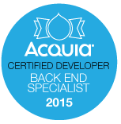

Hace unos meses tomé la certificación para [Backend Developer de Acquia](https://training.acquia.com/registry?field_first_name_value=&field_last_name_value=&city=&country=mx&field_exam_tid=41). Es una certificación que me parece hoy por hoy tiene poco valor en el mercado latinoamericano, mucho menor en México, ya que es prácticamente desconocida (soy el único no por chido sino por que nadie la ubica jajaja). Al menos tiene poco valor con los clientes locales. Pero eso no quiere decir que no valga la pena tomarla.

En primer lugar vale la pena porque creo que está muy bien hecha. Los temarios son muy completos, es casi imposible nada más machetear (memorizar) para poder pasar, así que requiere mucha práctica, repaso de temas y en general que le des una desempolvada y repasada completa a tus conocimientos drupaleros. Como herramienta de evaluación de tu entrenamiento en Drupal creo que la gente de Acquia logró realizar un trabajo muy completo.

Con clientes que ya conocen Drupal también tiene un valor que creo que puede ir incrementando con el tiempo. Pero debo reconocer que esa no debe ser la razón que uses para decidir si quieres certificarte.Pero bueno, ahí lo tienen, si tienes un programa de entrenamiento, creo que actualmente la certificación es una de los mejores herramientas para evaluar que tanto vas avanzando. Incluso si no pasas la certificación, sabrás en que partes de hace falta poner más atención para que puedas concentrarte en ellas.Si estas pensando certificarte, hay [4 certificaciones](http://acquia.com/certification) para elegir:

*   Site Building
*   Drupal Developer
*   Back end Specialist
*   Front end Specialist

Creo que la de site building no vale tanto la pena. Es bastante básica y como su nombre lo dice, te evalúa sólo en conocimientos de configuración (site building) de Drupal. La de Drupal Developer es la más general, que incluye conocimientos de front y back end. Creo que es la apropiada para empezar tu certificación. Pero si tu ya sabes que estas especializado en back o front end, pues adelante ;-).

