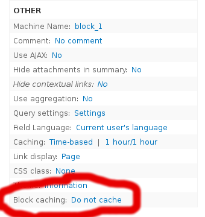
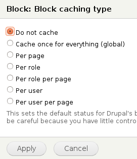

### Boost, Varnish y las optimizaciones de frontend

Existen varias maneras de mejorar el desempeño de un sitio en Drupal. Las más efectivas son usar **[boost](https://drupal.org/project/boost)** (cuando sólo tienes un servidor) o **[varnish](https://www.drupal.org/project/varnish)** (cuando tu sitio es más grande y puedes usar más de un servidor). Pero estas soluciones son exclusivas para usuarios anónimos, porque lo que hacen es guardar el contenido generado por Drupal y servirlo directo al visitante sin ni siquiera pasar por PHP o la base de datos. Aún cuando tienes usuarios autenticados te conviene primero mejorar el rendimiento de los usuarios anónimos que seguramente son más numerosos y así reducir la carga sobre tu servidor.

Una vez que empiezas a tener usuarios la cosa se complica. Pero hay optimizaciones generales que ayudan tanto a usuarios autenticados como no autenticados.

Drupal por default tiene la capacidad de **comprimir y agregar los archivos CSS y JS**, así como asegurarte de estar usando siempre el **sistema de imágenes** (imagecache o image styles) de drupal para servir imágenes más pequeñas; esto reducirá el tamaño y el número de archivos que se tienen que descargar tus visitantes. Mientras más chica sea tu página (imagenes, html, archivos) más rápida será.

### Actualizar el software y usar el mejor stack de Drupal posible

El software continuamente se está mejorando, así que tener la última versión de Drupal y los módulos que utilizas, además de todo tu stack (PHP, la base de datos, el servidor web) te ayudará al rendimiento. Por ejemplo

*   Entre PHP 5.3 y 5.4 hubo una [mejora en el rendimiento](http://news.php.net/php.internals/57760) del 7% en el CPU y del 50% en el uso de memoria, al usar Drupal
*   MySQL 5.5 es más eficiente que 5.0 ([con sus asegunes](http://dba.stackexchange.com/questions/31412/which-mysql-version-to-use-5-1-or-5-5)), en particular el optimizador de queries es mucho mejor en 5.5 que en 5.0
*   En lo posible reemplazar [Apache por nginx](http://www.axai.com.mx/es/blog/setup-de-ambiente-de-desarrollo-ubuntu-debian) es siempre una buena idea ya es más eficiente en memoria y procesador
*   Asegurarte de usar APC o algún OpCache (PHP 5.5 trae el Zend Optimizer incluído) y bien configurado, en particular la memoria disponible (apc.shm\_size en apc y opcache.memory\_consumption en Zend)
*   Usar [pressflow](http://pressflow.org/) si usas drupal 6 ([¿Por qué pressflow?](http://fourword.fourkitchens.com/article/what-makes-pressflow-scale-1-faster-core-queries))
*   Busca un hosting que tenga disco duro de estado sólido. Eso ayuda muchísimo, sobre todo si estás usando boost, que sirve las páginas directo desde el sistema de archivos

### Usar el cache de views, panels y blocks

Aún cuando no puedes usar el cache de página completa con usuarios autenticados, de cualquier manera hay elementos de tu página que puedes guardar en cache para evitar consultas costosas en la BD.

En el caso de los bloques sólo se tiene que habilitar donde mismo que se habilita el caché de páginas. Cada módulo que define bloques es responsable de definir si el bloque se puede cachar o no. Por ejemplo, cuando defines un bloque usando views, puedes usar el cache de bloques (en la columna de opciones avanzadas):

Hablando de vistas, el módulo views también tiene su propio método de caching que de hecho también se ve en la imágen de arriba. Son 2 métodos distintos, uno es inherente a views, y el otro es de bloques sólamente. El método normal de views de caching es muy bueno, porque toma en cuenta todos los argumentos y filtros expuestos. Y tu le dices cuánto tiempo quieres que guarde un resultado en cache. Mientras que con el cache de bloques no tienes mucho control sobre cuánto tiempo se va a guardar en cache.

Si estás usando panels para construir las páginas de tu sitio, también puedes usar el cache de panels para guardar elementos de tu página en el cache.

### APC, Memcache y Redis

Una vez empiezas a guardar cosas en cache, o a tener usuarios anónimos, notarás como el estres sobre tu base de datos empieza a aumentar. Para ver este aumento en el estres puedes utilizar herramientas como [XHProf](https://www.drupal.org/project/XHProf) (ampliamente recomendado), el MySQL Workbench, o simplemente habilitar el log de queries a la BD que viene con el módulo devel. Y mientras más utilices el cache de vistas, panels y bloques esto va a ir aumentando, porque ese cache se guarda en la base de datos. Al menos hasta que habilites otro método como APC, Memcache o Redis:

*   [APC.](https://www.drupal.org/project/apc) Si sólo estás utilizando un servidor es lo mejor. Si usas drupal 6 usa [Cache Router](https://www.drupal.org/project/cacherouter) para usar APC
*   [Memcache](https://www.drupal.org/project/memcache) y [Redis](https://www.drupal.org/project/redis) si tu sitio es más grande y empiezas a usar más de un servidor. Ambos funcionan igual, y simplemente por su versatilidad creo que conviene más aprender a utilizar Redis

Estos sistemas lo que hacen es guardar el cache fuera de la base de datos y directamente en memoria RAM. Conforme los utilices monitorea tu uso de memoria porque es posible que empieces a necesitar más.

### Miscelaneo

Algunos métodos más que pueden o no ser relevantes para tu sitio son:

*   Si tu sitio ofrece la opción de búscar notarás que la búsqueda nativa de Drupal no es muy eficiente. Por eso existen muchas opciones para cambiar el motor de búsqueda. Mis preferidas son usar [search\_api](https://drupal.org/project/search_api) con [solr](https://drupal.org/project/search_api_solr) o [elasticsearch](https://www.drupal.org/project/elasticsearch_connector). Y reciéntemente usamos [Sphinx](http://sphinxsearch.com/) para un sitio, pero esto era porque las búsquedas las hacíamos directo con SQL.
*   Optimizar tus queries. Si tienes vistas muy pesadas que no puedes guardar en cache tal vez te conviene considerar estas 3 opciones:
*   *   Cambiar el display de "content" a fields. Esto es porque si usas el display de content (o de panels o de display suite), lo que la vista hace es hacer un query con tus filtros trayendo solo el ID de tus entidades, y luego hace otro query (o varios) por cada entidad que estás mostrando. Si cambias el display a fields sólamente hará un query para traer todos los campos.
    *   Cambiar el paginador del completo, al lite. Esto es porque el paginador completo necesita hacer un count query para obtener el número total de elementos a mostrar (y poder decirte cual es la última página). Este query, cuando tienes muuuucho contenido, es muuuuuy pesado.
    *   Dejar de usar views, y hacer el query a mano, para poder optimizarlo tú mismo.
    
    Monitorear el log de errores de drupal, muchos de estos errores pueden estar alentando tu sitio. Por ejemplo, si tienes muchos 404, corrígelos, y tal vez también considera usar un módulo como [fast404](https://www.drupal.org/project/fast_404) porque en sitios grandes cada 404 es costoso.
    
*   Desinstala módulos. Tener muchos módulos equivale a mucho código que se tiene que cargar cada que un sitio no se sirve desde el cache. En particular los módulos de dblog y de statistics alentan mucho los sitios. Las alternativas son usar syslog y google analytics o [piwik](http://drupal.org/project/piwik)

Y pues creo que es todo por ahora.

Otras buenas referencias en Internet para mejorar el rendimiento de drupal:

*   [¿Cómo lograr un performance de 3000 request por segundo usando APC, Memcached y Varnish?](https://groups.drupal.org/node/25617). Aunque lo interesante es que Drupal llega hasta 300 request por segundo. Ya después cuando usas varnish o boost pues es simplemente nginx o varnish el que llega a 3,000.
*   [El manual de drupal.org sobre cómo mejorar el performance](https://www.drupal.org/node/627252). Es un wiki así que puedes ayudar a mantenerlo actualizado.
*   [Comparativo de módulos para mejorar el performance en groups.drupal.org](https://groups.drupal.org/node/21897). También es un wiki.