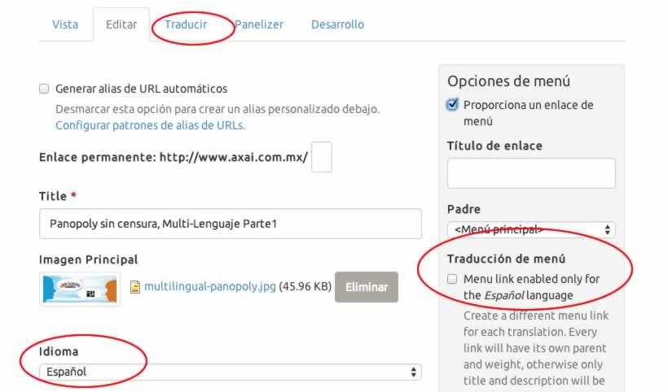
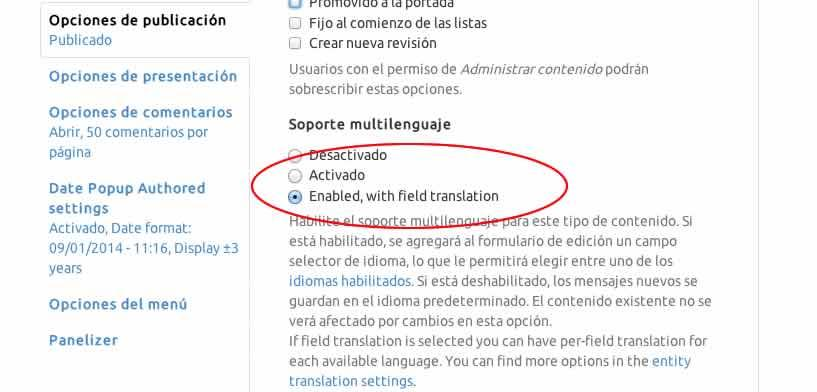

Dentro de un contexto globalizado, si una empresa desea aumentar su volumen en ventas, no es extraño que se apoye en las diferentes tecnologías de la Información para desplegar traducciones de la gama de servicios y productos que ofrece, buscando así la concurrencia del cliente potencial  extranjero. 

El hecho es que hoy en día es más común encontrar que el flujo de información de algún sitio en Internet se despliegue en varios idiomas; ya sea para no quedar fuera del mercado competitivo o para aumentar simplemente su contador de visitas.

Como desarrolladores  seguro contemplamos este requerimiento al implementar una aplicación con esas características, y de manera estoica, extendemos la funcionalidad multi lenguaje que viene por _default_ utilizando el módulo de [Internationalization](http://drupal.org/project/i18n), ([i18n](https://www.drupal.org/project/i18n)).

### Pero analicemos este panorama:

Nos interesa crear un sitio basado en [Panopoly](https://www.drupal.org/project/panopoly) ya que nos ofrece una solución de rápido desarrollo con la característica funcionalidad que conlleva, pero…

No obstante que [Panopoly](https://www.drupal.org/project/panopoly) reúne una serie de módulos contribuidos y herramientas  que nos facilitan la vida, sólo podemos encontrar un  módulo de lenguaje dentro de la distribución: _Panels translation_ (_i18n\_panels_); aparte de los ya conocidos que vienen en el core de **Drupal 7**: _Locale_ y _Content Translation_. ¿Entonces cuáles más hay que utilizar y cómo los configuramos?

Dentro de esta serie de publicaciones la cual he titulado "**Panopoly sin censura**” hablaré de esos detalles que quizás nos hemos topado al utilizar esta distribución la cual reúne la magia de [Panels](http://drupal.org/project/panels), [panelizer](http://drupal.org/project/panelizer), [ctools](http://drupal.org/project/ctools) y demás .

Particularmente en esta primera parte, recapitularemos los módulos que requerimos para implementar nuestro sitio sitio **Multi-Lenguaje**.

### “Esa peculiar manera en que Drupal gestiona el multi lenguaje”

Aquí cabría realizar el siguiente cuestionamiento.

¿Cuántos idiomas soportará nuestro sitio?

¿Queremos traducir todo el contenido o sólo parte de éste?

¿Los contenidos de cada idioma serán nodos independientes o queremos un solo nodo con todas las traducciones? Por ejemplo, habría quien quisiera separar las noticias de algún sitio dependiendo su localización.

A manera de lista ordenada retomemos entonces los pasos para configurar la funcionalidad multi-lenguage, esto  desde luego aplica también para una instalación limpia de **Drupal 7**. 

1) En nuestra distribución de [Panopoly](http://drupal.org/project/panopoly), activamos los módulos del core _Locale_ y _Content Translation _.

2) Con _Locale_ podremos seleccionar otros idiomas y cargar las traducciones de la Interfaz. Desde luego si queremos que nuestras traducciones se mantengan al día,  también es útil instalar y activar [Localization update](https://www.drupal.org/project/l10n_update) para ello.  Para nuestro sitio por ahora sólamente cargamos el idioma español.

**Administration >> Configuration >> Regional and language >> Languages**.

Ahora se configura el método en que Drupal detectará los diferentes lenguajes en nuestro sito (URL, session, browser). 

**Administration >> Configuration >> Regional and language >> Languages >> Detection and selection .**

_Content translation_ es el encargado de habilitar las traducciones de nuestros tipos de contenido. Con ello podremos tener un "select list" en el formulario de edición que nos permitirá elegir el lenguaje para cada nodo creado además de agregar  traducciones activando la edición en la pestaña correspondiente; lo que creará un nuevo nodo traducido y relacionado con el original.

Para activar tal funcionalidad lo hacemos desde **Administration >> Structure >> Content types >> Blog (por ejemplo),** y en la pestaña vertical de  Opciones de Publicación **(Publishing options) **damos click en el selector correspondiente en **Multilingual support.**

Esto puede parecer algo truculento, porque en realidad estaremos creando un nuevo nodo y no campos del mismo nodo traducido, lo cual es favorable si se pretende mantener entes separados en su respectivo lenguaje, de esta manera, si nuestro tipo de contenido es por ejemplo un **blog**, los comentarios de cada post serán exclusivos para cada idioma.

Con estas acciones ya deberíamos tener lista, en teoría, la funcionalidad ML. Pero esperen, ¿Qué pasa con los demás items de nuestro desarrollo, es decir, los menus, las taxonomías, formularios de contacto, los usuarios, etc.?

3) Lo siguiente que hacer es instalar y activar el antes mencionado módulo de [Internationalization](http://drupal.org/project/i18n). 

Con eso se extenderá la funcionalidad de lenguaje en nuestro sito y para nuestro caso habilitaremos los sub módulos de:

_\- Menu translation. Que activa una interfaz para la traducciòn de nuestros menus._

_\- Panel translation (que viene con Panopoly)_

_\- Variable translation. Que nos permite traducir variables com:  El nombre del sitio,  su eslogan, etc._

4) Muy bien, ahora queremos que nuestras traducciones se hagan sólo para los campos de nuestras "Content pages",  de esa manera tendremos un nodo con múltiples traducciones (lo cual nos ahorrará consultas a la BD).

Instalamos el módulo [Title](http://drupal.org/project/title) para lograr que el comportamiento por defecto del título de un nodo sea remplazado por un campo título completamente traducible.

Y por último, pero no por ello menos importante,  instalamos y activamos [Entity Translation](http://drupal.org/project/entity_translation). Recordemos activar el bullet para las traducciones de campos en cada tipo de contenido que deseamos.

También activamos el sub módulo _Entity Translation Menu_ paraextender la funcionalidad de la traducción de menus desde la propia edición de cada entidad. 

Bueno, hasta aquí tenemos ya nuestros módulos necesarios para una funcionalidad **Multi Lenguaje**, dejando el terreno listo para cargar  contenido y comenzar el flujo de trabajo para las treducciones.

**En la siguiente parte de nuestro post veremos como logramos tener el Front page traducido, como traducir panels y como hacer para que secciones definidas  en nuestro sitio (como el Footer), cambien al idioma correspondiente. **

Les recuerdo que su comentarios, aportaciones y preguntas son bienvenidas.